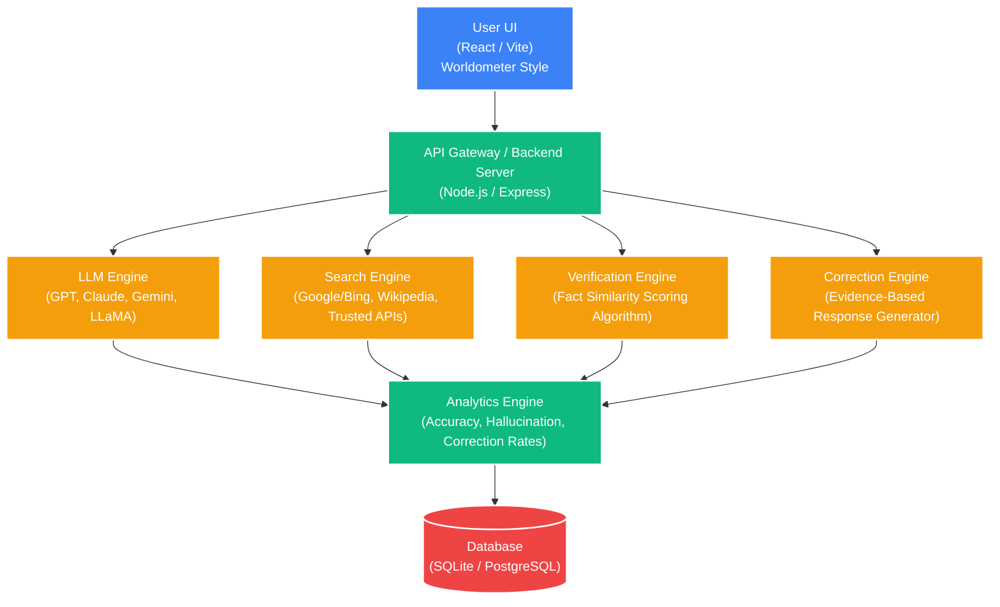
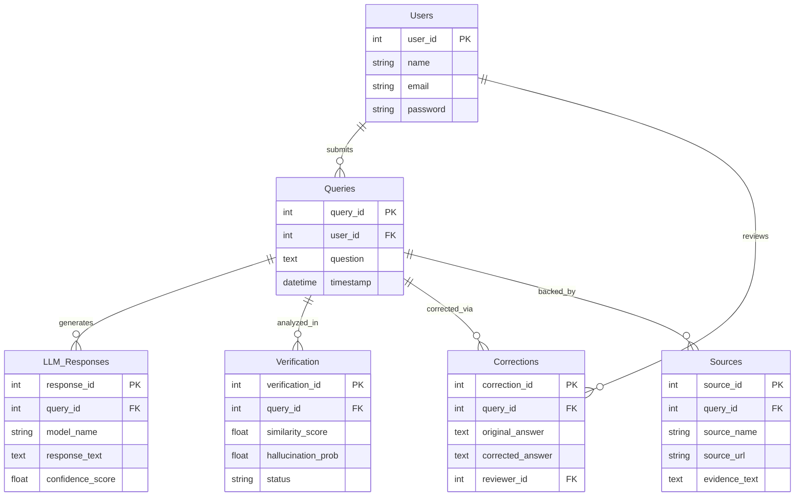

# TruthGuard AI - Research Project Documentation

This documentation contains the system architecture, database design, and research methodology for the TruthGuard AI LLM Hallucination Diagnostic Tool. These materials are prepared for inclusion in project reports, presentations, and posters.

---

## 1. System Architecture Diagram

The architecture follows a standard client-server model with dedicated engines for AI comparison, search, and fact verification.

### Components Explained
* **Frontend**: Question input, LLM comparison UI, Dashboard graphs, and Manual review interface.
* **Backend**: Handles API calls, processes model responses, and computes verification scores.
* **LLM Engine**: Generates answers from multiple models simultaneously.
* **Search Engine**: Retrieves evidence from trusted sources.
* **Verification Engine**: Compares AI answers with external evidence.
* **Correction Engine**: Generates corrected responses when hallucinations are detected.
* **Analytics Engine**: Creates metrics used in the dashboard.

---

## 2. Database ER Diagram

The database is structured to track users, their queries, the distinct responses from various LLMs, and the subsequent verification and correction actions.

### Explanation
* **Users**: Stores platform users and reviewers.
* **Queries**: Stores all user-submitted questions.
* **LLM Responses**: Stores independent responses from different LLMs (GPT, Claude, etc.).
* **Verification**: Stores hallucination detection results and similarity scores.
* **Corrections**: Stores manually or automatically corrected responses.
* **Sources**: Stores external evidence citations used for factual verification.

---

## 3. Research Methodology

**Title**: LLM Hallucination Detection and Verification using Multi-Model Comparison and Evidence-Based Fact Checking

The research pipeline operates across 10 distinct steps:

### Step 1 — Question Input
User submits a question to the system.
*Example: "What is the capital of France?"*

### Step 2 — Multi-LLM Response Generation
The system queries multiple Large Language Models in parallel.

| Model | Response |
|-------|----------|
| GPT | Paris is the capital of France |
| Claude | Paris is the capital city of France |
| Gemini | Lyon is the capital of France |
| LLaMA | Paris is the capital |

### Step 3 — Evidence Retrieval
The Search engine retrieves trustworthy sources (Wikipedia, Britannica, Research databases).
*Evidence extracted: "Paris has been the capital of France since 987 AD."*

### Step 4 — Fact Extraction
Critical entity relationships are extracted from the retrieved evidence.
*Example: Entity: France, Capital: Paris*

### Step 5 — Response Comparison
Each AI response is rigorously compared against the extracted facts using:
1. Cosine similarity
2. Keyword matching
3. Semantic similarity analysis

### Step 6 — Hallucination Detection
The similarity score is thresholded to explicitly determine hallucinations.
* Rule: `If similarity_score < 0.6 → Hallucination`
* Rule: `If similarity_score >= 0.6 → Verified`

| Model | Similarity | Result |
|-------|------------|--------|
| GPT | 0.95 | Verified |
| Claude | 0.96 | Verified |
| Gemini | 0.21 | Hallucination |
| LLaMA | 0.94 | Verified |

### Step 7 — Score Calculation
A weighted final verification score is calculated dynamically:
`Final Score = (0.4 * Evidence Similarity) + (0.3 * Source Reliability) + (0.3 * Model Confidence)`

### Step 8 — Manual Review
Human reviewers intercept flagged answers and categorize them as Correct, Partially Correct, or Hallucination, appending manual corrections if necessary.

### Step 9 — Correction Engine
If a hallucination is detected, the engine ranks the retrieved trusted sources and synthesizes a verified, corrected answer.
*Corrected Answer: "Paris is the capital of France."*

### Step 10 — Analytics Generation
The diagnostic system continuously streams calculated metrics back to the primary Worldometer-style dashboard:
* Total Question Volume
* Global Accuracy Rate
* Platform Hallucination Rate
* Correction Application Rate

---

## Key Project Innovations
This capstone system introduces several novel implementations to the field of LLM oversight:
* A proprietary **Multi-LLM comparison framework**
* An **Evidence-based hallucination detection** algorithm
* A human-in-the-loop **manual correction mechanism**
* Granular **model reliability analytics**
* A high-visibility, **Worldometer-style AI dashboard** for real-time statistical tracking.
